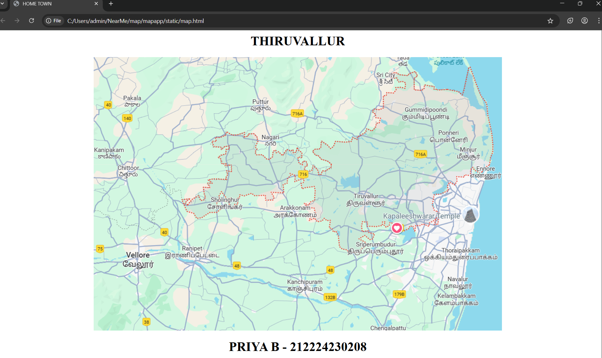
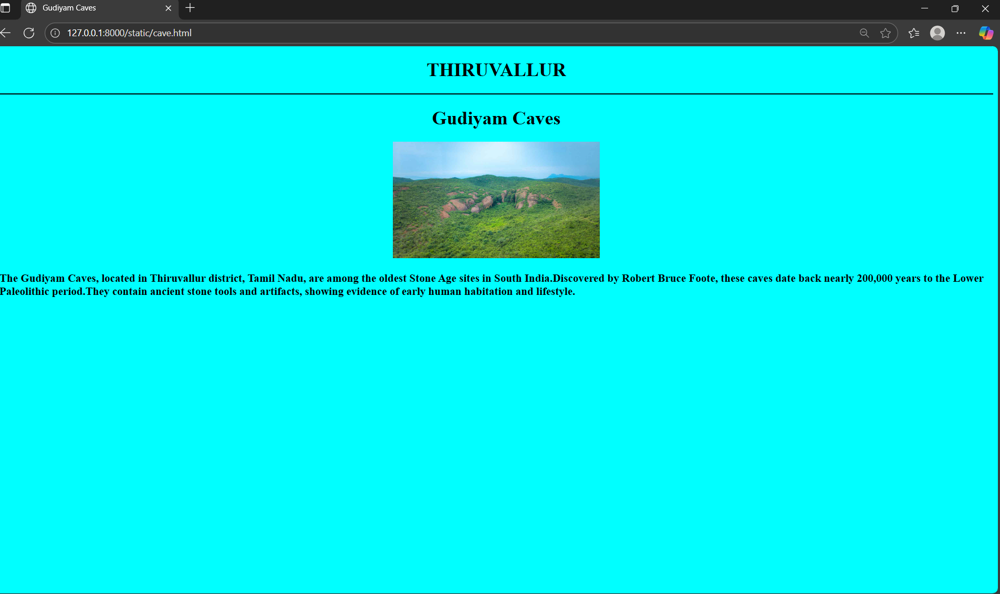
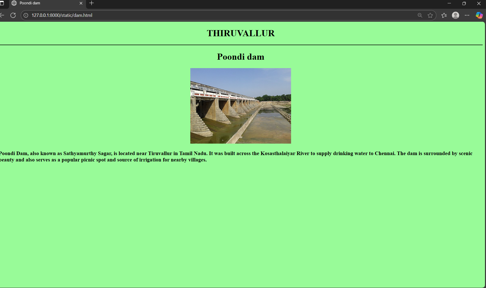
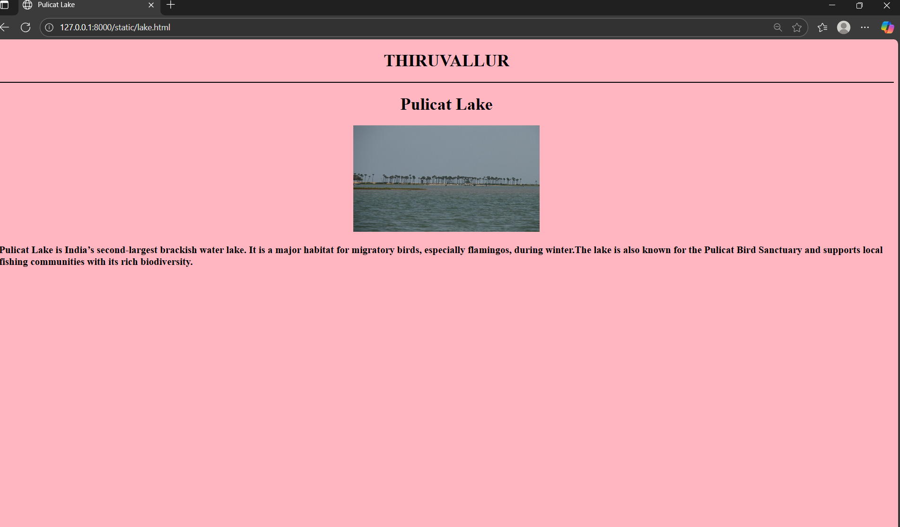
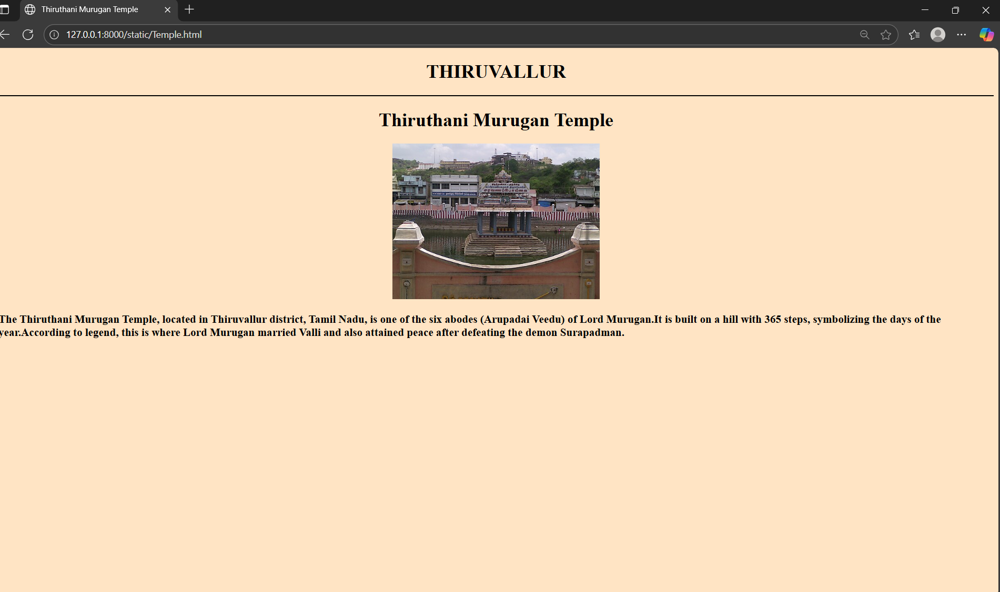

# Ex04 Places Around Me
## Date: 17.10.25

## AIM
To develop a website to display details about the places around my house.

## DESIGN STEPS

### STEP 1
Create a Django admin interface.

### STEP 2
Download your city map from Google.

### STEP 3
Using ```<map>``` tag name the map.

### STEP 4
Create clickable regions in the image using ```<area>``` tag.

### STEP 5
Write HTML programs for all the regions identified.

### STEP 6
Execute the programs and publish them.

## CODE
### map.html:
```
<html>
<head>

    <title>HOME TOWN</title>
    
</head>
<body>
    <h1 align="center">THIRUVALLUR</h1>
    <center>
        
        <map name="MyCity">
            <area shape="rect" coords="634,230,674,265" title="Gudiyam Caves" href="cave.html">
            <area shape="rect" coords="665,316,679,377" title="Thiruthani Murugan Temple" href="Temple.html">
            <area shape="rect" coords="940,34,980,138" title="Pulicat Lake" href="lake.html">
            <area shape="rect" coords="663,299,664,325" title="Poondi dam" href="dam.html">
        </map>
    </center>
    <center><footer><h1>PRIYA B - 212224230208</h1></footer></center>
</body>
</html>
```

### cave.html:
```
<!DOCTYPE html>
<html lang="en">
<head>
    <meta charset="UTF-8">
    <meta name="viewport" content="width=device-width, initial-scale=1.0">
    <title>Gudiyam Caves</title>
</head>
<body style="background-color: aqua;"> 
    <h1 style="text-align: center;">THIRUVALLUR</h1>
    <hr color="black">
    <center><h1>Gudiyam Caves</h1></center>
    <center></center>
    <h3>The Gudiyam Caves, located in Thiruvallur district, Tamil Nadu, are among the oldest Stone Age sites in South India.Discovered by Robert Bruce Foote, these caves date back nearly 200,000 years to the Lower Paleolithic period.They contain ancient stone tools and artifacts, showing evidence of early human habitation and lifestyle. </h3>
    
</body>
</html>
```

### dam.htlm:
```
<!DOCTYPE html>
<html lang="en">
<head>
    <meta charset="UTF-8">
    <meta name="viewport" content="width=device-width, initial-scale=1.0">
    <title>Poondi dam</title>
</head>
<body style="background-color: palegreen;">
    <center><h1>THIRUVALLUR</h1></center>
    <hr color="black">
    <center><h1>Poondi dam</h1></center>
    <center></center>
    <h3>Poondi Dam, also known as Sathyamurthy Sagar, is located near Tiruvallur in Tamil Nadu. It was built across the Kosasthalaiyar River to supply drinking water to Chennai. The dam is surrounded by scenic beauty and also serves as a popular picnic spot and source of irrigation for nearby villages.</h3>
</body>
</html>
```

### lake.html:
```
<!DOCTYPE html>
<html lang="en">
<head>
    <meta charset="UTF-8">
    <meta name="viewport" content="width=device-width, initial-scale=1.0">
    <title>Pulicat Lake</title>
</head>
<body style="background-color: lightpink;">
    <center><h1>THIRUVALLUR</h1></center>
    <hr color="black">
    <center><h1>Pulicat Lake</h1></center>
    <center></center>
    <h3>Pulicat Lake is India’s second-largest brackish water lake. It is a major habitat for migratory birds, especially flamingos, during winter.The lake is also known for the Pulicat Bird Sanctuary and supports local fishing communities with its rich biodiversity. </h3>
</body>
</html>
```

### temple.html:
```
<!DOCTYPE html>
<html lang="en">
<head>
    <meta charset="UTF-8">
    <meta name="viewport" content="width=device-width, initial-scale=1.0">
    <title>Thiruthani Murugan Temple</title>
</head>
<body style="background-color: bisque;">
    <center><h1>THIRUVALLUR</h1></center>
    <hr color="black">
    <center><h1>Thiruthani Murugan Temple</h1></center>
    <center></center>
    <h3>The Thiruthani Murugan Temple, located in Thiruvallur district, Tamil Nadu, is one of the six abodes (Arupadai Veedu) of Lord Murugan.It is built on a hill with 365 steps, symbolizing the days of the year.According to legend, this is where Lord Murugan married Valli and also attained peace after defeating the demon Surapadman.</h3>
</body>
</html>
```


## OUTPUT
### MAP


### CAVE


### DAM


### LAKE


### TEMPLE



## RESULT
The program for implementing image maps using HTML is executed successfully.
